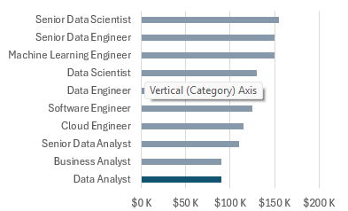
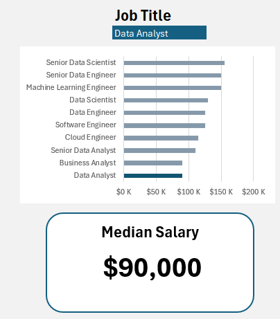
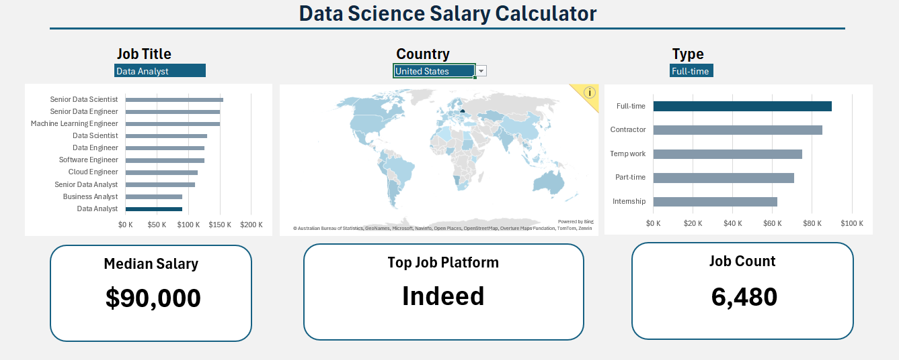

# Excel Salary Dashboard


## Introduction

This Data Jobs Salary Dashboard was created to help job seekers explore salary trends for various roles and assess whether they are or going to be fairly compensated.


### Dashboard File
My final dashboard is in [Salary Dashboard.xlsx](Salary%20Dashboard.xlsx).

### Excel Skills Used

The following Excel skills were utilized for analysis:

- **📉 Charts**
- **🧮 Formulas and Functions**
- **❎ Data Validation**

### Data Jobs Dataset

The dataset used for this project contains real-world data science job information from 2023. It includes detailed information on:

- **👨‍💼 Job titles**
- **💰 Salaries**
- **📍 Locations**
- **🛠️ Skills**

## Dashboard Build

### 📉 Charts

#### 📊 Data Science Roles Salaries - Bar Chart




- 🛠️ **Excel Tools:** Applied bar chart visualization (with formatted salary figures) and adjusted layout for better clarity.  
- 🎨 **Visualization Style:** Chose a horizontal bar chart to make salary comparisons more intuitive.  
- 📉 **Data Structuring:** Arranged job titles in descending order of salary for easier interpretation.  
- 💡 **Key Takeaways:** Highlights salary patterns, showing that Senior positions and Engineers generally earn more than Analyst roles.  


#### 🗺️ Country Median Salaries - Map Chart


- 🛠️ **Excel Tools:** Used Excel’s map chart feature to visualize median salaries worldwide.  
- 🎨 **Visualization Style:** Applied color-coding to distinguish salary levels across different regions.  
- 📊 **Data Display:** Mapped median salaries for each country with available information.  
- 👁️ **Readability Boost:** Enhanced clarity and allowed quick understanding of geographic salary patterns.  
- 💡 **Key Takeaways:** Provides an overview of global pay differences, highlighting both high- and low-salary regions.  


### 🧮 Formulas and Functions

#### 💰 Median Salary by Job Titles

```
=MEDIAN(
IF(
    (jobs[job_title_short]=A2)*
    (jobs[job_country]=country)*
    (ISNUMBER(SEARCH(type,jobs[job_schedule_type])))*
    (jobs[salary_year_avg]<>0),
    jobs[salary_year_avg]
)
)
```

- 🔍 **Advanced Filtering:** Applies conditions for job title, country, schedule type, while ignoring blank salary entries.  
- 📊 **Array-Based Formula:** Leverages the `MEDIAN()` function combined with nested `IF()` statements to process arrays.  
- 🎯 **Focused Insights:** Delivers targeted salary details by job role, location, and work schedule.  
- 🔢 **Formula Role:** Fills the table below with the median salary according to the selected job title, country, and schedule type.  


🍽️ Background Table


📉 Dashboard Implementation



#### ⏰ Count of Job Schedule Type

```
=FILTER(J2#,(NOT(ISNUMBER(SEARCH("and",J2#))+ISNUMBER(SEARCH(",",J2#))))*(J2#<>0))
```

- 🔍 **Unique Value Extraction:** Uses the `FILTER()` function to remove entries with "and," commas, or zero values.  
- 🔢 **Formula Role:** Generates the table below by providing a distinct list of job schedule types.  


🍽️ Background Table


📉 Dashboard Implementation:


### ❎ Data Validation

#### 🔍 Filtered List

- 🔒 **Improved Data Validation:** Applied the filtered list as a validation rule under `Job Title`, `Country`, and `Type` in the Data tab to ensure:  
  - 🎯 Inputs are limited to approved, validated schedule types  
  - 🚫 Errors and inconsistent entries are avoided  
  - 👥 Dashboard usability and reliability are strengthened  



## Conclusion
I developed this dashboard to highlight salary patterns across different data-focused job titles. Using real-world 2023 job market data, it provides users with valuable insights to guide their career choices. The dashboard also demonstrates how factors such as location and job type can impact compensation. Overall, this tool serves as both an informative resource and a practical aid for anyone seeking to better understand and navigate salary trends in the data industry.